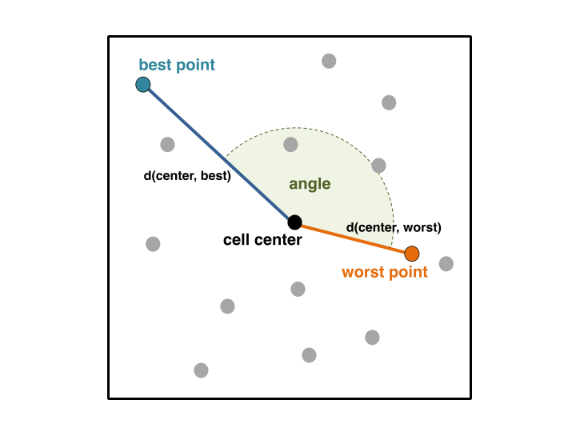

# Cell Mapping Features

The idea of *cell mapping* is that a continuous search space is partitioned in
every dimension, thus achieving a discretization of the original search space
into cells. This discretization of a sample into a number of cells, with
several points per cell, allows for an improved estimation of properties such
as the *global structure* and *multimodality* of an optimization problem.

# Angle

The initial idea of the *angle features* is that the best and worst values
within the cells might return some insight of the underlying function's
landscape. If those two observations lie in opposite directions, it indicates a
trend within the cell. In that case the angle between the vectors from cell
center to worst value and cell center to best value would be close to 180&deg;.
By aggregating the angles of all cells from the grid (using the mean and the
standard deviation), two features are provided.

Furthermore, the standard deviation of the lengths of the two above-mentioned
vectors are used as additional features. In case of simple functions (such as
the sphere function), the variation should be low as the majority of the cells
should have similar distances -- due to the fact that they usually lie close to
the borders of the cells. In case of very multimodal functions, the variation
should be rather high as cells with local optima result in contrary distances
(short distances of the best values and long distances of the worst values)
compared to cells without any local optima.

Since interactions between cells are ignored, i.e. these features are computed
locally per cell, the features are considered to be independent from the
search space dimensionality.

(Inspired by Kerschke, P. et al., 2014)

# Cell Convexity

For these feature sets, all possible combinations of three (linearly)
neighbouring cells within the grid are computed. Per default, only horizontally
and vertically neighbouring cells are considered. By passing `diag = TRUE` as a
parameter to `calculateCellConvexity`, diagonally neighbouring cells are
considered as well.

In all of those cases, each of the three cells is represented by a single
prototype. Those are then used to approximate the concavity or convexity of the
landscape.

Given the function evaluations of the three neighbouring cells, this feature is
calculated by computing the convex-combination between f(x1) and
f(x3) and comparing it to the value of f(x2).
The figure below illustrates the resulting decision, i.e. whether a combination
indicates convexity or concavity: Place the value of f(x2) above
x2 and infer the corresponding decision.

(Inspired by Kerschke, P. et al., 2014)

# Gradient Homogeneity

For every point within a cell's sample, we find the nearest neighbor and compute the individual, normalized difference vector, which is always rotated so that it is pointing to the worse point. Then, we compute the length of the vector sum of the individual vectors amd divide it by the maximal possible vector length (equals the number of points due to normalization). For completely randomly distributed objective values, the fraction should be around 0 (vectors pointing in all directions), for a strong trend the values should approach 1.0 (all vectors point into the same direction).

From the individual values for each cell, we obtain two features by computing the mean and the standard deviation over all cells, taking only the homogeneity within each cell into account. Simple unimodal functions shall thus generate very high mean values.

Since interactions between cells are ignored, i.e. these features are computed locally per cell, these features are independent from the search space dimensionality.

(Inspired by Kerschke, P. et al., 2014)

# Literature Reference
Kerschke, P. et al. (2014), "Cell Mapping Techniques for Exploratory Landscape Analysis", in EVOLVE-A Bridge between Probability, Set Oriented Numbers, and Evolutionary Computation V, pp. 151--131, Springer ([http://dx.doi.org/10.1007/978-3-319-07494-8_9](http://dx.doi.org/10.1007/978-3-319-07494-8_9)).