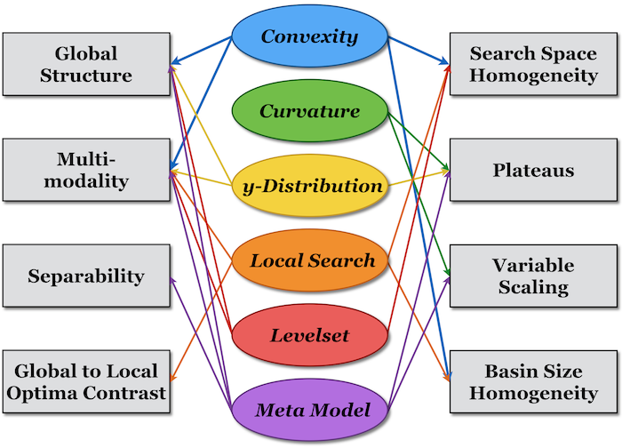

# Classical ELA Features

The term *Exploratory Landscape Analysis (ELA) features* (as introduced by Mersmann et al., 2011) summarizes a group of characteristics, which quantifies certain properties of a continuous optimization problem. In its original version, ELA covered a total of 50 features - grouped into six so-called *low-level properties* (Convexity, Curvature, y-Distribution, Levelset, Local Search and Meta Model). These (numerical values) were used to characterize (usually categorical and expert-designed) *high-level properties*, such as the *Global Structure*, *Multimodality* or *Variable Scaling*.
The figure below visualizes the connections between the low- and high-level properties.

(Inspired by Mersmann et al., 2011)

A detailed description of the features can be found in Mersmann et al. (2011).

## Literature Reference
Mersmann et al. (2011), "Exploratory Landscape Analysis", in Proceedings of the 13th Annual Conference on Genetic and Evolutionary Computation, pp. 829--836. ACM ([http://dx.doi.org/10.1145/2001576.2001690](http://dx.doi.org/10.1145/2001576.2001690)).