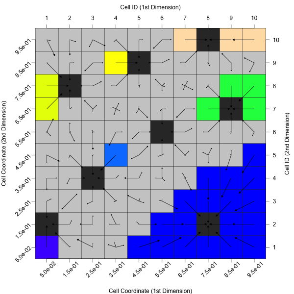

# Generalized Cell Mapping Features

*Generalized cell mapping (GCM)* discretizes the continuous search space in the same way, as described in the [previous section (Cell Mapping)](cm.md).
However, in contrast to the previous section, the GCM approach is based on transition probabilities between the cells and interprets them by making use of (absorbing) Markov chains.

For each cell, a representative objective function value is chosen. Consequently, the cell mapping abstracts from the original function evaluations and reduces the number of values to (at most) one per cell.

Three approaches are used for finding the representative value for each cell: minimum (`"min"`), average (`"mean"`), and nearest prototype (`"near"`). In the `"near"` approach, the representative value is the one that is closest to a cell's center. In the `"mean"` approach, all values that are located in one cell are averaged to create the representative value of that cell. For the `"min"` approach, the minimum of one cell's values is used as the representative value.
Note that in case of an empty cell, only the `"near"` approach is able to find a representative value for that cell.

```{r}
X = createInitialSample(n.obs = 1200, dim = 3)
y = rowSums(X^2)
feat.object = createFeatureObject(X = X, y = y, blocks = c(4, 6, 3))
calculateFeatureSet(feat.object, set = "gcm")
```

## Example

The following example will create a Generalized Cell Mapping of the 17th BBOB function (Schaffer's F7) based on the nearest prototype approach.

```{r}
library(smoof)
library(flacco)

## (1) Create data
X = expand.grid(seq(0, 1, length.out = 50), seq(0, 1, length.out = 50))
f = smoof::makeBBOBFunction(dimension = 2, fid = 17, iid = 9)
y = apply(X, 1, f)

## (2) Compute a feature object
feat.object = createFeatureObject(X = X, y = y, fun = f, blocks = c(10, 10))

## (3) Plot the corresponding cell mappings
plotCellMapping(feat.object, control = list(gcm.approach = "near"))
```



As you can see within the plot, the cell mapping indicates 62 uncertain cells (the grey boxes) and 8 attractor cells (the black boxes), whose basins (colored areas) have a size of 1 to 19 cells (when counting the attractors towards the basins). All of these numbers (as well as some more characteristics) can be found among the corresponding features:

```{r}
## calculate the corresponding GCM features
calculateFeatureSet(feat.object, set = "gcm", control = list(gcm.approaches = "near"))
```

For a complete overview of the features, please refer to the documentation of `calculateFeatureSet`.

## GCM Terms

**Attractor** / **Periodic cell**:

- a cell, which only leads to itself and thus absorbs transitions
- candidate for a local optima

**Transient cell**:

- a cell that is not periodic and therefore, the system will leave these cells with a given certainty (> 0)
- the terms below can be used to further classify transient cells

**Uncertain cell**:

- a cell, which leads to multiple attractors

**Basin**:

- a set of cells, which lead to the same attractor

## Literature Reference
Kerschke, P. et al. (2014), "Cell Mapping Techniques for Exploratory Landscape Analysis", in EVOLVE-A Bridge between Probability, Set Oriented Numbers, and Evolutionary Computation V, pp. 151--131, Springer ([http://dx.doi.org/10.1007/978-3-319-07494-8_9](http://dx.doi.org/10.1007/978-3-319-07494-8_9)).