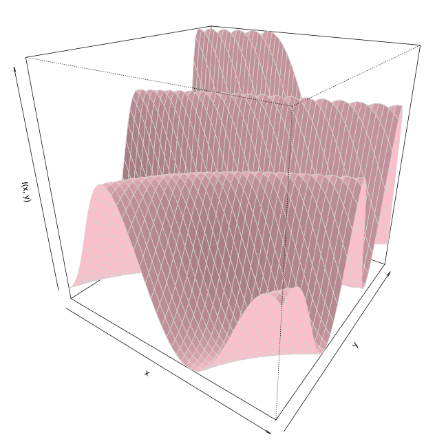
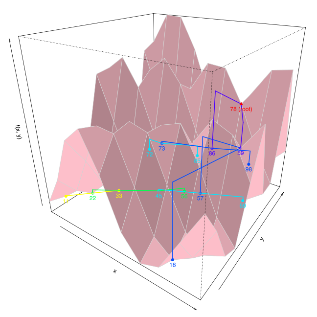
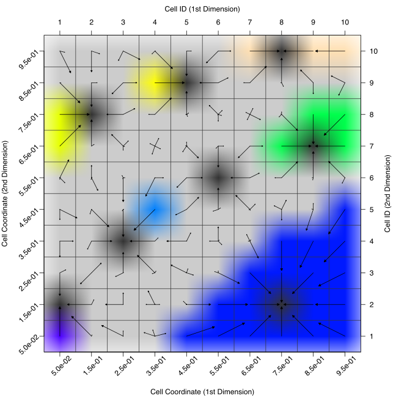

# Calculation of a Simple Feature

For simple features you typically only need to supply the data that you have at hand.  For this, the arguments `X` and `y` should be passed towards `createFeatureObject`, as illustrated in the example below.

The function `createFeatureObject` creates a `FeatureObject` instance, which holds relevant information about the input data. These instances are always the first argument to any feature-calculating function in **flacco**.

```{r}
library(flacco)

## (1) Create some example-data
X = createInitialDesign(n.obs = 500, dim = 2)
y = apply(X, 1, function(x) sum(sin(x) * x^2 + (x - 0.5)^3))

## (2) Compute the feature object
feat.object = createFeatureObject(X = X, y = y)

## (3) Have a look at feat.object
print(feat.object)

## (4) Calculate a feature set, e.g. the ELA meta model features
calculateFeatureSet(feat.object, set = "ela_meta")
```


# Calculation of Expensive Features

Some features need to perform further function evaluations in order to compute the feature values. Therefore, one can pass the function `fun` to the `FeatureObject`.

Note, that it is also possible to only pass `X` and `fun` to `createFeatureObject` -- the values of `y` will be automatically be computed!

For example, the feature set `"ela_conv"` needs to know the original function. But don't worry -- if you don't pass the function, `calculateFeatureSet` will complain and give you a hint.

```{r}
library(flacco)

## (1) Create data (note that objective values are not set here!)
X = createInitialDesign(n.obs = 2000, dim = 5)

## (2) Compute the feature object
feat.object = createFeatureObject(X = X, fun = function(x) sum(x^2))

## (3) Have a look at feat.object
print(feat.object)

## (4) Calculate the ELA convexity features
calculateFeatureSet(feat.object, set = "ela_conv")
```

Usually, you find more information on the exact number of additional function evaluations within the documentation of `calculateFeatureSet`. The following example shows you, how you could control the size of the generated sample:

```{r}
## Calculate the convexity features using a sample of size 500, 
## instead of the default of 1000.
calculateFeatureSet(feat.object, set = "ela_conv", control = list(ela_conv.nsample = 500))
```

A lot of our functions allow to configure certain details on how features should be computed using the `control` list parameter. However, as each function supports different parameters it is advisable to have a look into the corresponding documentation `?calculateFeatureSet`.


# Calculation of a Cell Mapping Feature

Cell mapping features differ from the others in the fact that they convert a continuous search space into a discretized one. This is achieved by dividing the entire search space into a grid with a finite amount of cells (per dimension) and assigning each observation to exactly one cell. Afterwards, the search space is only regarded as a set of discrete cells.

Consequently, you need to define the grid by specifying the number of cells per dimension when creating a `FeatureObject`. If you don't provide them, the attempt of computing a cell mapping feature will abort with an error.

```{r}
library(flacco)

## (1) Create data
X = createInitialDesign(n.obs = 2000, dim = 5)
y = rowSums(X^2)

## (2) Compute a feature object
feat.object = createFeatureObject(X = X, y = y, blocks = c(10, 5, 5, 8, 4))

## (3) Have a look at feat.object
print(feat.object)

## (4) Calculate cell mapping features, e.g. the gradient homogeneity features
calculateFeatureSet(feat.object, set = "cm_grad")
```

The above example splits the data into 10 blocks in the first dimension, 5 blocks in the second and third, 8 blocks in the fourth, and 4 blocks in the fifth. If you always want the same amount of blocks in every dimension, you can simplify your input:

```{r}
## Compute the feature object
feat.object = createFeatureObject(X = X, y = y, blocks = 5)
``` 


# Creating Explanatory Plots

Some features come with additional plots that visualize the features or intermediate results. For example, the mechanics behind the [Generalized Cell Mapping approach](gcm.md) are sometimes hard to grasp. For that reason, a plot visualizes a (two-dimensional) grid and indicated the transition probabilities from any cell to its basins using proportional arrows.
Also, the [Barrier Tree](barriertrees.md) usually become more clear, when visualizing them.

```{r}
library(smoof)
library(flacco)

## (1) Create data
X = expand.grid(seq(0, 1, length.out = 50), seq(0, 1, length.out = 50))
f = smoof::makeBBOBFunction(dimension = 2, fid = 17, iid = 9)
y = apply(X, 1, f)

## (2) Compute a feature object
feat.object = createFeatureObject(X = X, y = y, fun = f, blocks = c(10, 10))

## (3) Now, one could create various explanatory plots

## (3a) Visualize the figure in a 3D perspective/surface plot
persp(matrix(y, nrow = 50), shade = 0.1, theta = 35, phi = 25,
  border = "lightgrey", zlab = "f(x, y)", xlab = "x", ylab = "y", col = "pink")

## (3b) Based on a combination of 'persp' and the barrier tree idea,
## one now can produce 3D plots of the barrier trees
ctrl = list(gcm.approach = "near", bt.persp_border = "lightgrey",
  bt.persp_theta = 35, bt.persp_phi = 25, bt.color_surface = "pink",
  bt.persp_shade = 0.1, bt.persp_ticktype = "simple",
  bt.persp_xlab = "x", bt.persp_ylab = "y", bt.persp_zlab = "f(x, y)")
plotBarrierTree3D(feat.object, control = ctrl)

## (3c) The barrier trees can also be visualized in a 2D plot
plotBarrierTree2D(feat.object, control = list(gcm.approach = "near", bt.cm_surface = FALSE))

## (3d) Alternatively, one can plot the cell mappings
plotCellMapping(feat.object, control = list(gcm.approach = "near"))
```

The following plots represent the figures, which were created by the R-code above.






